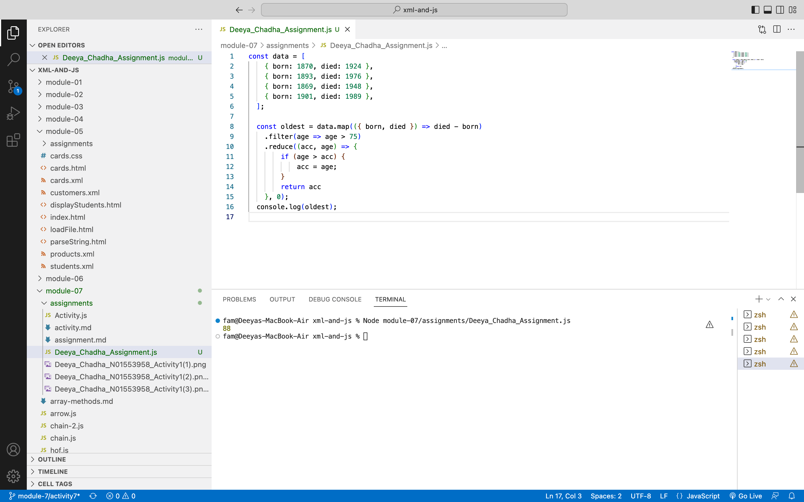

# Assignment

- Save following data into `data` variable

```js
[
  { born: 1870, died: 1924 },
  { born: 1893, died: 1976 },
  { born: 1869, died: 1948 },
  { born: 1901, died: 1989 },
];
```

const data = [
    { born: 1870, died: 1924 },
    { born: 1893, died: 1976 },
    { born: 1869, died: 1948 },
    { born: 1901, died: 1989 },
  ];
  

- Map `data` and calculate age for each entry (died - born) and save into new variable `age`
      const oldest = data.map(({ born, died }) => died - born)

- Filter `age` to be greater than 75 and save into `filtered` variable
     .filter(age => age > 75)

- Reduce `filtered` to output the highest age and save into `oldest` variable
      .reduce((acc, age) => 

- Refactor your code to use chaining
     const age = data.map(({ born, died }) => died - born)
    .filter(age => age > 75)
    .reduce((acc, age) => {
        if (age > acc) {
            acc = age;
        }
        return acc
    }, 0);

- console.log the result
       console.log(age);

- Attach screenshot of the output in your terminal
